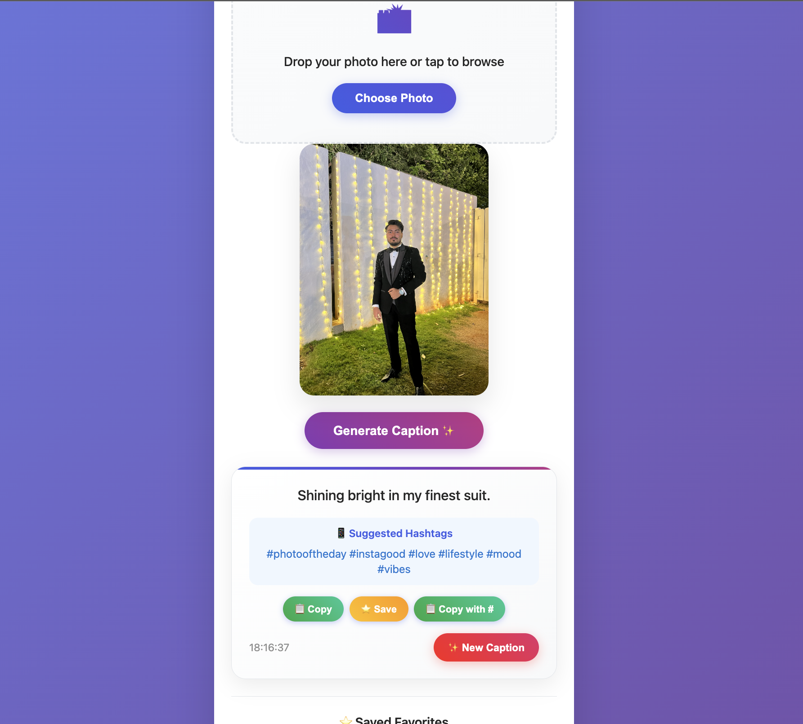

<h1 align="center">
  
  <span style="color:#e1306c;">InstaCaption AI</span>
  
</h1>

<p align="center">
  <i>"Style speaks louder than filters — make your captions roar."</i>  
</p>

<p align="center">
  
  
  
</p>

<p align="center">
  
</p>

---

## 💡 What is InstaCaption AI?

> Upload a 📸, and get an **Instagram-worthy** caption that makes people stop scrolling.  
> Powered by **Google Gemini**, wrapped in **pure sexy frontend**.

---

## ⚡ Preview

> **🎯 Your UI in action:**

<p align="center">
  
</p>

---

## 🧠 Features That Pop

- 🖼 Drag-and-drop photo upload  
- ✨ Gemini-powered intelligent captioning  
- 🧩 Real-time caption regeneration  
- 🪄 Hashtag wizard: Based on content type  
- 📋 One-click copy / 💾 Save as favorites  
- 💎 Fully animated UI with gradient buttons, blur effects, and pulse glow  
- 🔥 No backend needed – *just plug your API key and go*

---

## 🛠 Tech Stack

| Tech | Role |
|------|------|
| 💻 HTML / CSS / JS | Frontend UI/UX |
| 🔮 Gemini API | Caption generation |
| 🖼 FileReader + Base64 | Image encoding |
| 🧠 Rule-based Logic | Hashtag detection |
| 🧠 `localStorage` | Save favorites |

---

## 🧪 How to Use

```bash
1. Clone this repo or download ZIP
2. Open `index.html` in your browser
3. Insert your Gemini API key in the JS:
   const apiKey = "YOUR_API_KEY"
```

<div class="animated-list">
  <h2>🌈 UI Highlights</h2>
  <ul>
    <li>✨ Glassmorphic design & gradients</li>
    <li>📱 Mobile-ready</li>
    <li>🔁 Regeneratable AI captions</li>
    <li>📋 Copy or Save to favorites</li>
    <li>⚡ Super smooth animations</li>
  </ul>
</div>

<h2 style="text-align:center; color:white;">💡 Coming Soon</h2>
<ul>
  <li style="animation-delay: 2.5s;">🎯 AI-powered hashtag generator</li>
  <li style="animation-delay: 3s;">🧠 Caption mood selector (Funny, Classy, etc.)</li>
  <li style="animation-delay: 3.5s;">☁️ Deployable to Netlify / GitHub Pages</li>
</ul>


